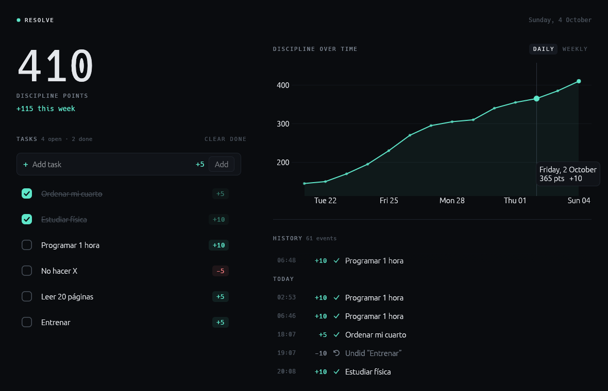

# Resolve

Resolve turns discipline into something you can see and measure.

Create tasks, give each one a value in **Discipline Points** (`+10` for studying, `-5` for the
habit you're trying to break), and check them off. Every check changes your score, lands in
your history and moves the chart. That's it: a small, fast desktop app that does a few things
well.



## What it does

- **Tasks** with a name and a positive or negative point value, completed with a checkbox.
  Drag rows to reorder them.
- **Day calendar**: drag tasks onto the day, move blocks to another time, or stretch them from
  the bottom edge to change their duration. Times snap to 15 minutes.
- **Discipline Score**: the sum of everything you've earned or lost, plus this week's change.
- **Discipline Over Time**: an animated line chart with a daily and a weekly view. Hover a
  point to see the events behind it; click it to highlight them in the history.
- **History**: a chronological log of every change to your score.

Every action has a consequence, and they all go through the same path: completing a task
records an event, the event changes the score, and the chart and history read that same
event log. Unchecking a task reverts its points and is recorded too. Moving a block in the
calendar changes the task's schedule and is saved before the block settles into place.
Everything is stored locally in SQLite; there are no accounts and no network.

Interactions use soft springs with a slight overshoot. If your system asks for reduced motion
(macOS "Reduce motion", Windows "Show animations" off, GNOME animations off), Resolve turns
springs, pulses and chart transitions off and behaves exactly the same otherwise. Set
`RESOLVE_REDUCED_MOTION=1` (or `0`) to override the detection.

## Install

Resolve is written in Rust. You need a recent stable toolchain (1.85 or newer), which you can
get from [rustup.rs](https://rustup.rs).

```bash
git clone https://github.com/0rtizSys/Resolve.git
cd Resolve
cargo build --release
```

The binary ends up in `target/release/resolve` (`resolve.exe` on Windows).

On Linux you also need OpenGL and the usual X11/Wayland libraries, which desktop installs
already have. On a minimal Debian/Ubuntu system:

```bash
sudo apt install libgl1 libxkbcommon-x11-0 libxcursor1 libxrandr2 libxi6
```

## Run

```bash
cargo run --release
```

Your data lives in a single `resolve.db` file in the platform data directory:

| Platform | Location |
| --- | --- |
| Linux | `~/.local/share/resolve/` |
| macOS | `~/Library/Application Support/Resolve/` |
| Windows | `%APPDATA%\Resolve\data\` |

Set `RESOLVE_DATA_DIR` to use a different directory, for example to try Resolve with a
throwaway database.

## Architecture

```text
src/
├── main.rs          window setup and startup
├── core/            business logic, no UI or storage code
│   ├── task.rs          Task, validation
│   ├── event.rs         DisciplineEvent (the history)
│   ├── schedule.rs      Schedule (calendar time and duration), day summary
│   ├── score.rs         DisciplineScore
│   ├── statistics.rs    score over time, events behind each point, weekly delta
│   ├── store.rs         Store trait (what core needs from storage)
│   └── tracker.rs       Tracker: the single entry point for changing state
├── persistence/     SQLite implementation of Store, with schema migrations
└── ui/              egui views: dashboard, task list, calendar, statistics, history,
                     plus motion.rs (springs and reduced motion)
```

The rules are simple:

- The **score is derived from events**. Events are append-only, so the score, the chart and
  the history can never disagree.
- The **UI never changes state directly**. Views return actions; the app hands them to the
  `Tracker`, which persists the change first and then updates memory.
- **Animations follow the model.** A drop is persisted first; the element then springs
  towards the position the model now gives it. Nothing moves that the data doesn't back.
- **Storage is behind a trait.** `core` doesn't know SQLite exists, and its tests run against
  an in-memory store.

New features (habits, achievements, settings…) should follow the same shape: model and rules in
`core`, a migration in `persistence`, a view in `ui`.

Built with [egui/eframe](https://github.com/emilk/egui) and
[egui_plot](https://github.com/emilk/egui_plot) for the UI, and
[rusqlite](https://github.com/rusqlite/rusqlite) for storage.

## Contributing

Contributions are welcome. Read [CONTRIBUTING.md](CONTRIBUTING.md) before opening a pull
request.

## License

[MIT](LICENSE)
